# Ubuntu Server Security

---
# Part 1

## Project Description

This project demonstrates the process of building and securing a local Ubuntu Server from scratch using virtualization.  
The goal of this part  is to deploy a functional server, configure essential network services, and apply basic security mechanisms such as firewalling and intrusion prevention.

This setup simulates an entry-level production server environment.

---

## Environment & Tools

- **Virtualization Software**: Oracle VirtualBox
- **Guest Operating System**: Ubuntu Server LTS
- **Network Mode**: Bridged Adapter
- **Services Installed**:
    - OpenSSH
    - vsftpd (FTP)
    - Nginx Web Server
    - UFW Firewall
    - Fail2Ban (IDS / IPS)

---

## 1. Virtual Machine & Network Configuration

A new virtual machine was created in VirtualBox and Ubuntu Server LTS was installed using the official ISO image.

**Network configuration:**
- Adapter type: **Bridged Adapter**

This configuration allows the virtual machine to receive an IP address from the local network and behave like a real server accessible from other devices on the LAN.

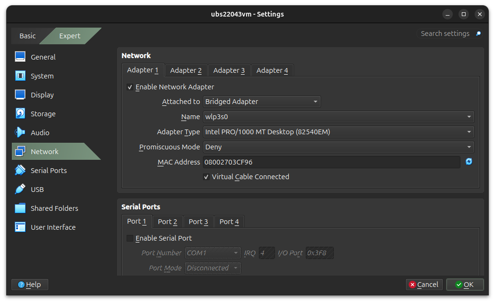

---

## 2. Network Verification

After installation, network connectivity was verified to ensure proper communication with the local network and the internet.

```bash
ip a
ip route
ping 8.8.8.8
```

The server successfully obtained an IP address and had outbound internet connectivity.

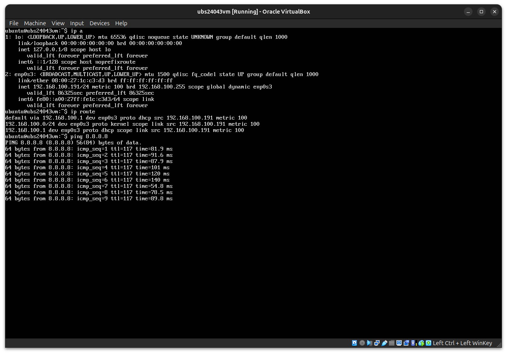

---

## 3. SSH Server Installation & Configuration

   ***SSH Installation***
```bash
sudo apt update
sudo apt install openssh-server -y
   ```


***SSH service status was verified:***
```bash
systemctl status ssh
```
***SSH Key-Based Authentication***

On the local machine, an SSH key pair was generated:
```bash
ssh-keygen
```

The public key was copied to the server:

```bash
ssh-copy-id user@SERVER_IP
```

On the server, SSH configuration was hardened:

```bash
sudo nano /etc/ssh/sshd_config
```

Applied settings:

```bash
PasswordAuthentication no
PubkeyAuthentication yes
PermitRootLogin no
```

Restarted SSH service:
```bash
sudo systemctl restart ssh
```

***Security justification:***
Disabling password authentication significantly reduces the risk of brute-force attacks against the SSH service.

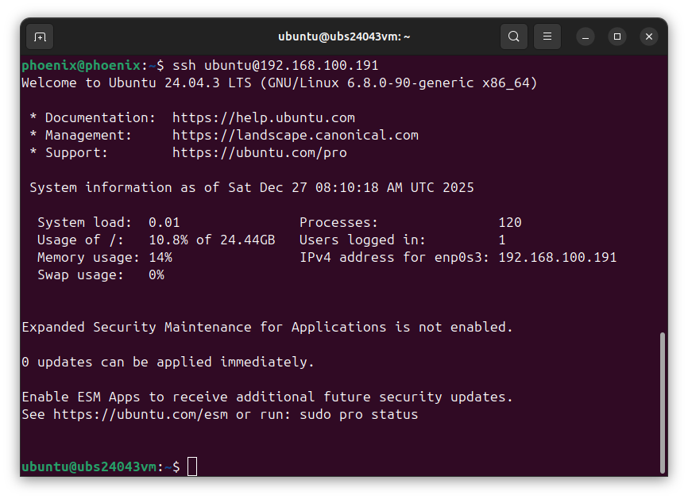

---

## 4. FTP Server Setup & Testing
   ***FTP Installation***
```bash
sudo apt install vsftpd -y
```
***FTP Configuration***
```bash
sudo nano /etc/vsftpd.conf
```

***Configured options:***

- Local user login enabled

- Write access enabled

- User isolation using chroot

***Restarted FTP service:***
```bash
sudo systemctl restart vsftpd
```
FTP Testing
```bash
ftp SERVER_IP
```

The FTP connection was successful, and file transfers were tested.

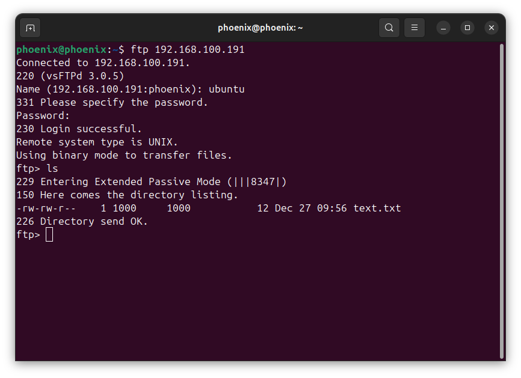

---
## 5. Web Server Installation

***Nginx web server was installed:***
```bash
sudo apt install nginx -y
```
Verification

- Opened a browser on the host machine

- Navigated to: http://SERVER_IP

The default Nginx welcome page loaded successfully

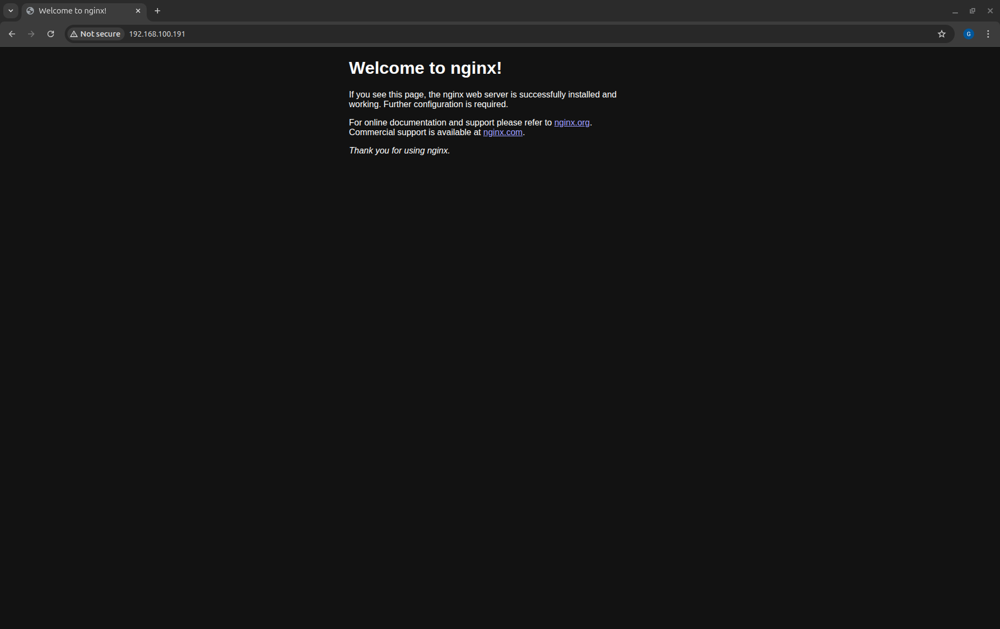

---
## 6. Firewall Configuration (UFW)
   ***Firewall Enablement***
```bash
sudo ufw allow ssh
sudo ufw enable
```
***Allow HTTP Traffic***
```bash
sudo ufw allow 80
```
***Firewall Testing***

HTTP traffic was blocked intentionally to verify firewall behavior:
```bash
sudo ufw deny 80
```

***Result:***

- Website became inaccessible from the browser

***HTTP traffic was then re-enabled:***
```bash
sudo ufw allow 80
```

***Result:***

- Website became accessible again

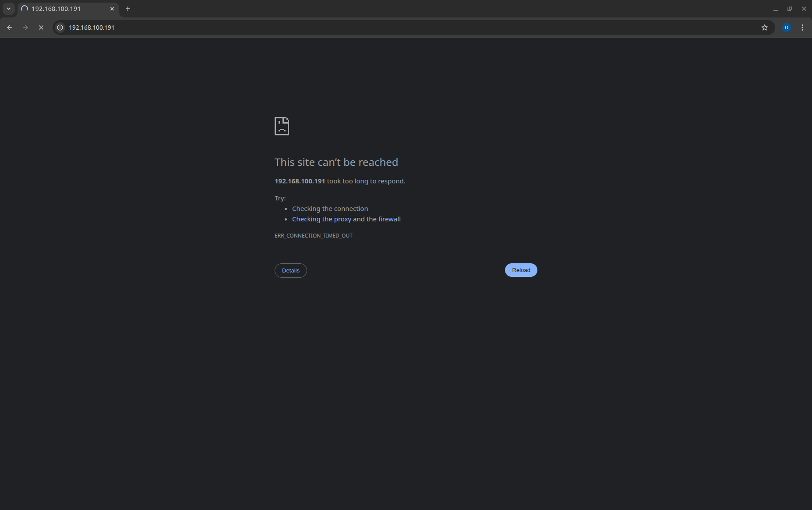

---

## 7. Intrusion Detection / Prevention – Fail2Ban
***Fail2Ban Installation***
```bash
sudo apt install fail2ban -y
```
***Configuration***
```bash
sudo cp /etc/fail2ban/jail.conf /etc/fail2ban/jail.local
sudo nano /etc/fail2ban/jail.local
```

***Enabled SSH protection:***
```bash
[DEFAULT]
ignoreip = 127.0.0.1/8 192.168.0.0/24
bantime  = 3600
findtime = 600
maxretry = 5
destemail = your@email.com
sender = fail2ban@example.com
action = %(action_mwl)s

[sshd]
enabled = true
port = ssh
filter = sshd
logpath = /var/log/auth.log

[vsftpd]
enabled = true
port = ftp
filter = vsftpd
logpath = /var/log/vsftpd.log
```

***Restarted Fail2Ban service:***
```bash
sudo systemctl restart fail2ban
```
***Verification***
```bash
sudo fail2ban-client status sshd
```

Fail2Ban was confirmed to be actively monitoring SSH authentication attempts.

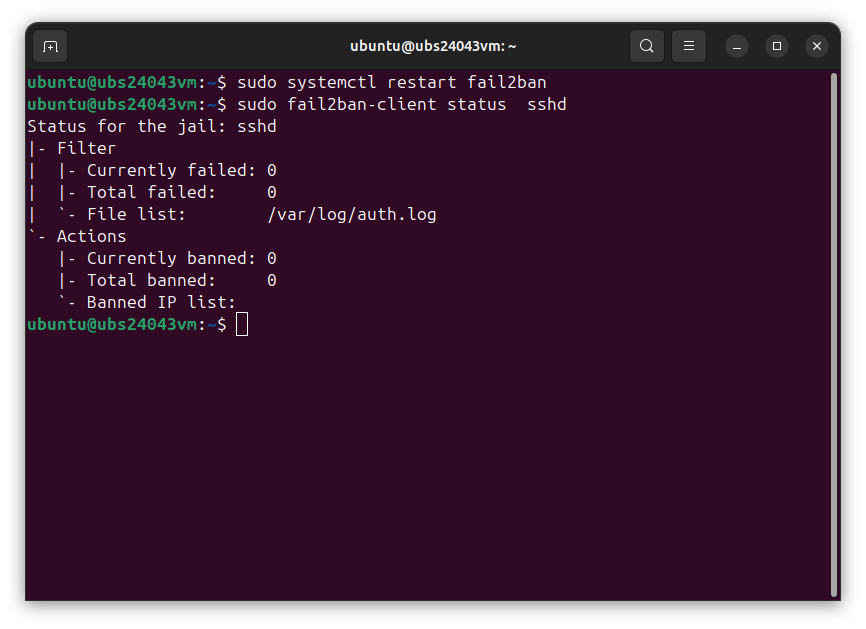

---

# Part 2

## Cloud Security & Administrator Practices

This part focuses on applying administrator-level security practices and role-based access control, simulating cloud server management.  
The goal is to ensure that each user has proper responsibilities, permissions are secure, and the server is protected from common attacks.

---

## 1. User & Role Management

### Users Created

Two main users were created to separate responsibilities:

```bash
sudo adduser sysadmin
sudo adduser webadmin
```
***Role Assignment***
```bash
sudo usermod -aG sudo sysadmin       # sysadmin can use sudo
sudo usermod -aG www-data webadmin   # webadmin manages website files
```

***Principle applied:*** Least Privilege – users only have the permissions necessary for their tasks.
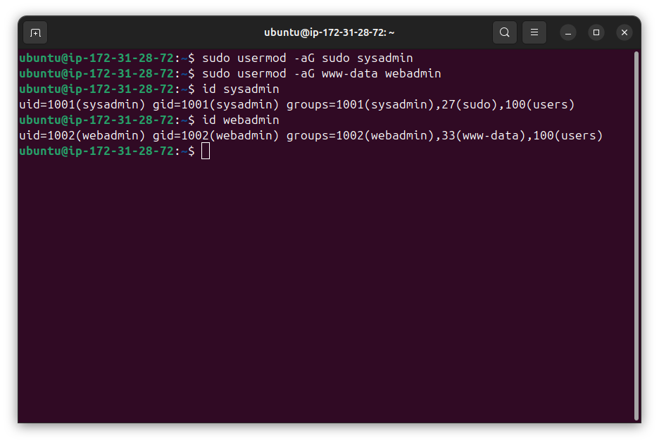

---
## 2. SSH Key Generation for Users

SSH key pairs are generated on the local machine (not on the server) for each user:
```bash
# For sysadmin
ssh-keygen -t rsa -b 4096 -f sysadmin_id_rsa

# For webadmin
ssh-keygen -t rsa -b 4096 -f webadmin_id_rsa
```

This ensures private keys never leave the local machine.

---
## 3. Copying Keys to Server via Root

Switch to root (or use sudo) and copy the public keys to each user's ~/.ssh/authorized_keys:
```bash
# Create .ssh directory for each user
sudo mkdir -p /home/sysadmin/.ssh
sudo mkdir -p /home/webadmin/.ssh

# Copy and paste the public key for sysadmin in authorized_keys
sudo nano /home/sysadmin/.ssh/authorized_keys

# Copy and paste the public key for webadmin in authorized_keys
sudo nano /home/webadmin/.ssh/authorized_keys
```
---
## 4. Setting Correct Permissions

Set ownership and permissions to secure the SSH keys:
```bash
# sysadmin permissions
sudo chown -R sysadmin:sysadmin /home/sysadmin/.ssh
sudo chmod 700 /home/sysadmin/.ssh
sudo chmod 600 /home/sysadmin/.ssh/authorized_keys

# webadmin permissions
sudo chown -R webadmin:webadmin /home/webadmin/.ssh
sudo chmod 700 /home/webadmin/.ssh
sudo chmod 600 /home/webadmin/.ssh/authorized_keys
```

***Login as:***
- **sysadmin**
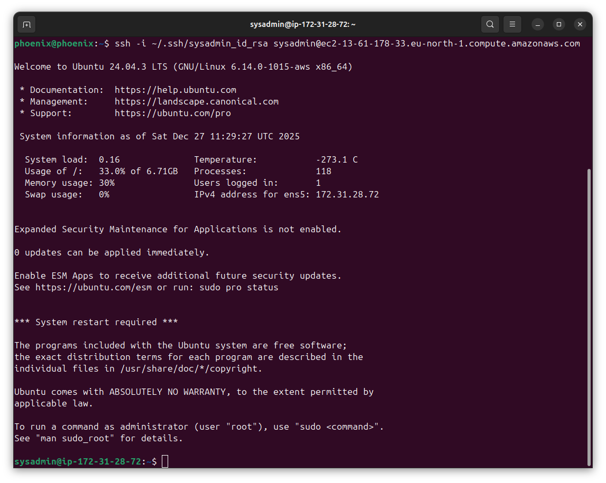
- **webadmin**


***Security justification:***
Only the owner can access their .ssh directory and authorized_keys file, preventing unauthorized access.

---
## 5. SSH Hardening

***To further secure SSH:***

1. Root login disabled:
```bash
PermitRootLogin no
```
2. Password authentication disabled:
```bash
PasswordAuthentication no
```
3. SSH access allowed only via firewall rules:
```bash
sudo ufw allow ssh
```
4. Restart SSH service after changes:
```bash
sudo systemctl restart ssh
```
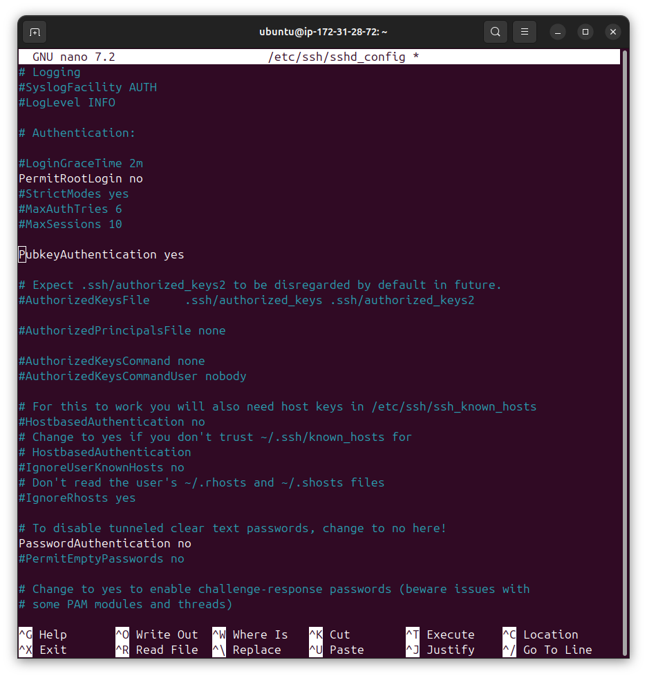

---
## 6. Brute Force Protection

- ***Fail2Ban active (configured in Part 1)***

- ***SSH*** key authentication required

- ***Firewall*** limits exposure to known ports

No brute-force testing performed for safety and compliance.

📸 Screenshot: fail2ban-status.png
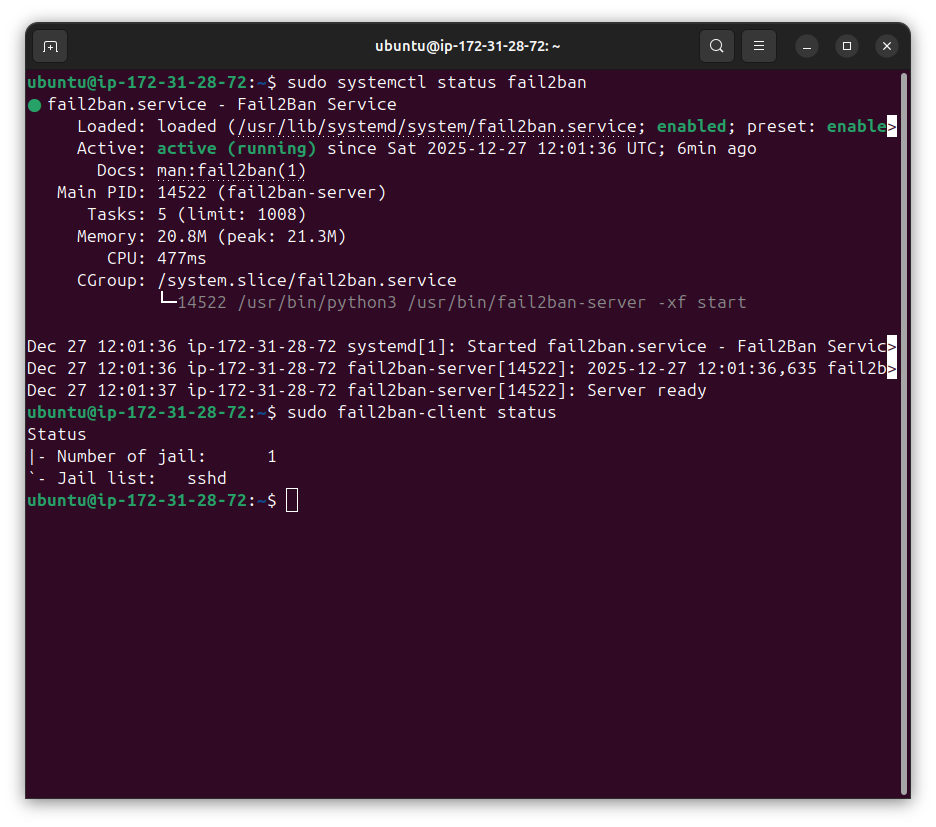

---
## 7. Manual Website Management

Before managing website files, administrative permissions must be configured by the main system administrator (`ubuntu` or `sysadmin`).

First, log in as the administrator and assign correct ownership and permissions to the web directory:

```bash
sudo chown -R webadmin:www-data /var/www/html
sudo chmod -R 750 /var/www/html
```
***This ensures that:***

- `webadmin` can create, edit, and delete website files

- the web server (www-data) has read access

- other users have no access

After permissions are set, the website files are managed by the `webadmin` user:
```bash
nano /var/www/html/index.html
```

Changes are reflected immediately in the browser without restarting the web server.

The sysadmin user can assist with file management if needed using elevated privileges, while webadmin remains responsible for content management.

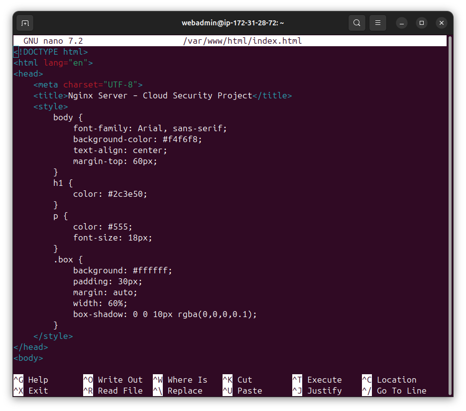

---
# BONUS

## Secure VPN Access (WireGuard)

### Overview

***WireGuard VPN was initially configured manually to demonstrate understanding of:***

- asymmetric cryptography

- peer-to-peer tunnel design

- key exchange

- Linux networking and firewalling

After validation, ***automation was introduced*** using a trusted WireGuard setup script to simplify future client provisioning.

---
## 1. Manual WireGuard Setup (Completed)
###   1.1 WireGuard Installation
```bash
sudo apt update
sudo apt install wireguard -y
```
### 1.2 Manual Key Generation (Example)

WireGuard uses ***Curve25519*** asymmetric keys.
Each peer (server/client) has ***one private key and one public key.***

***Generate Server Keys***
```bash
wg genkey | tee server_private.key | wg pubkey > server_public.key
```

***Result:***

- server_private.key → stays only on the server

- server_public.key → shared with clients

***Generate Client Keys***
```bash
wg genkey | tee client_private.key | wg pubkey > client_public.key
```

Each client has ***unique key pairs.***

***View Keys (for verification only)***
```bash
cat server_public.key
cat client_public.key
```

### 1.3 Manual Server Configuration
```bash
# /etc/wireguard/wg0.conf

[Interface]
PrivateKey = <SERVER_PRIVATE_KEY>
Address = 10.0.0.1/24
ListenPort = 51820
SaveConfig = true

[Peer]
PublicKey = <CLIENT_PUBLIC_KEY>
AllowedIPs = 10.0.0.2/32
```
### 1.4 Manual Client Configuration
```bash
# client.conf

[Interface]
PrivateKey = <CLIENT_PRIVATE_KEY>
Address = 10.0.0.2/24
DNS = 8.8.8.8

[Peer]
PublicKey = <SERVER_PUBLIC_KEY>
Endpoint = SERVER_PUBLIC_IP:51820
AllowedIPs = 0.0.0.0/0
PersistentKeepalive = 25
```

### 1.5 Enable IP Forwarding
```bash
sudo nano /etc/sysctl.conf
```

***Uncomment:***
```bash
net.ipv4.ip_forward=1
```

***Apply changes:***
```bash
sudo sysctl -p
```

### 1.6 Firewall Configuration
```bash
sudo ufw allow 56150/udp
sudo ufw reload
```

### 1.7 Start WireGuard
```bash
sudo systemctl enable wg-quick@wg0
sudo systemctl start wg-quick@wg0
```
---
## 2. Automated Configuration Using WireGuard Script

After verifying manual setup, automation was introduced.

### 2.1 Automated Setup Script
```bash
curl -O https://raw.githubusercontent.com/angristan/wireguard-install/master/wireguard-install.sh
chmod +x wireguard-install.sh
sudo ./wireguard-install.sh
```
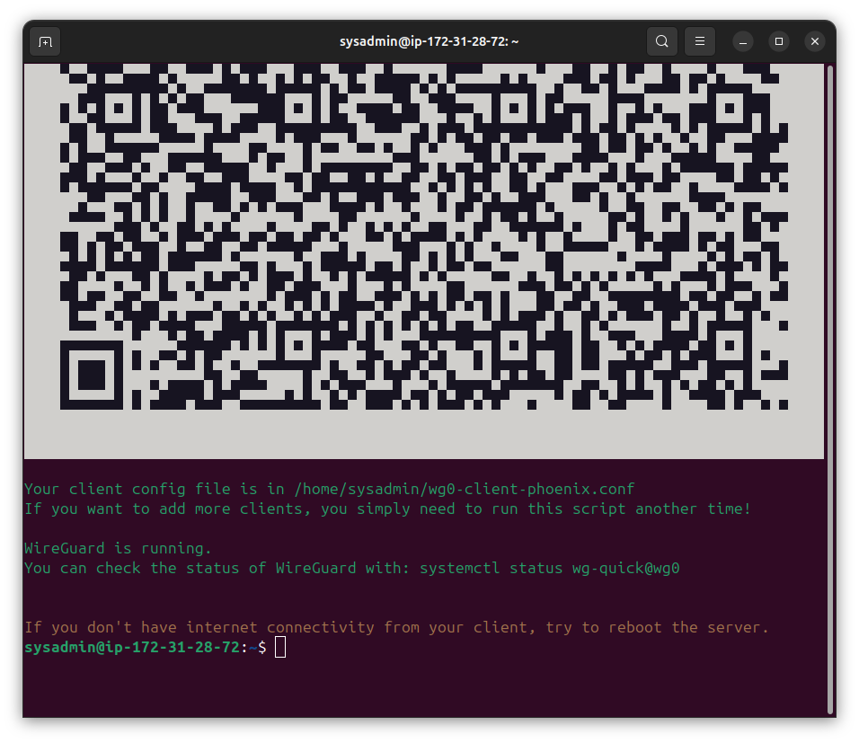
### 2.2 What the Script Automates

***The script automatically:***

- generates server & client keys

- assigns IPs

- creates config files

- enables routing

- manages firewall rules

- allows client add/remove
---
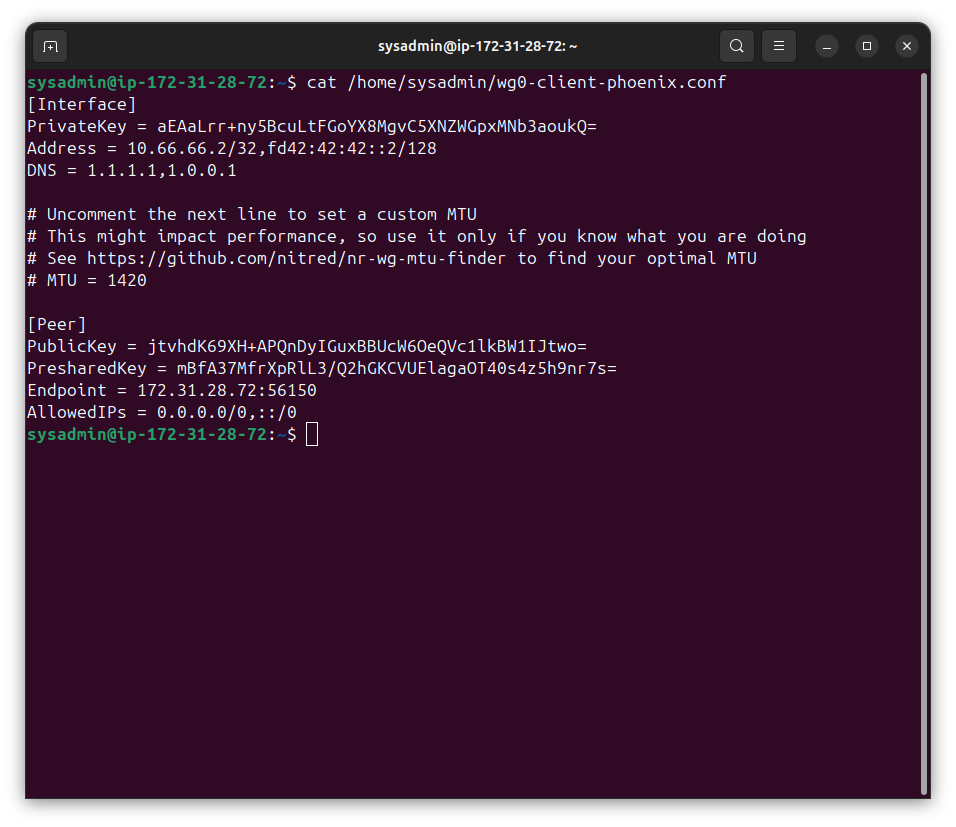

### 2.3 Client Configuration, Connection, and Testing

After generating client keys and configuration files, the client machine needs to be set up:

1. Copy the generated client configuration to the client machine:

2. Start WireGuard on the client:
```bash
sudo wg-quick up /home/user/client.conf
```
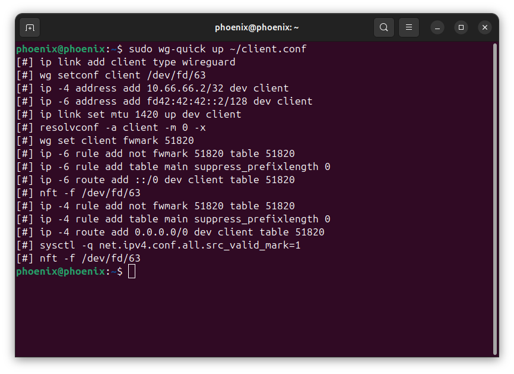

3. Verify the VPN connection:
```bash
sudo wg
ping 172.31.28.72
```
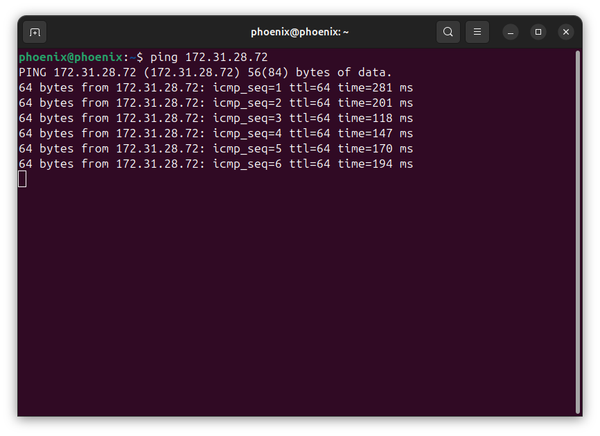

***Expected results:***

- The interface is active

- Handshake timestamp visible

- Successful ping to the server internal VPN IP (172.31.28.72)

📸 Screenshots:

screenshots/client-wg-up.png (WireGuard interface started on client)

screenshots/client-ping-test.png (Ping to server confirms connectivity)

Stop the VPN (if needed):

sudo wg-quick down /home/user/client.conf

## 3. Verification
```bash
sudo wg show
ip a show wg0
```
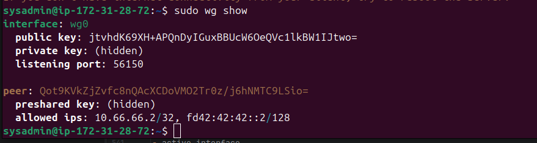

***Expected:***

- active interface

- handshake timestamp

- data transfer counters

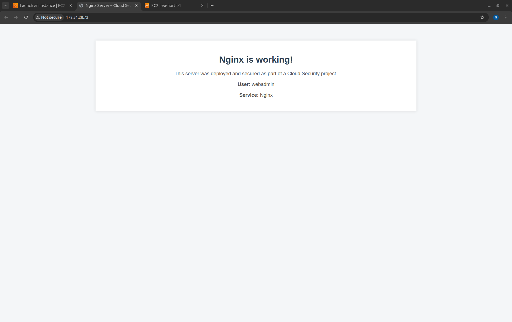

# HTTPS + Reverse Proxy (Nginx + TLS)
## Overview

***Goal:***

Demonstrate secure deployment of an existing DVWA installation using ***Nginx*** reverse proxy and ***HTTPS (TLS/SSL).***
> **Note:** DVWA and all necessary dependencies (PHP, extensions, etc.) are already installed in /var/www/html/dvwa.

## 1. Generate Self-Signed SSL Certificate

***Create a directory for SSL files:***
```bash
sudo mkdir -p /etc/nginx/ssl
```

***Generate certificate and private key:***
```bash
sudo openssl req -x509 -nodes -days 365 \
-newkey rsa:2048 \
-keyout /etc/nginx/ssl/dvwa.key \
-out /etc/nginx/ssl/dvwa.crt
```

> ***Notes:***
>- Fill in prompts (Country, State, City, Organization, Common Name = server IP or domain)
>- Certificate valid for 1 year

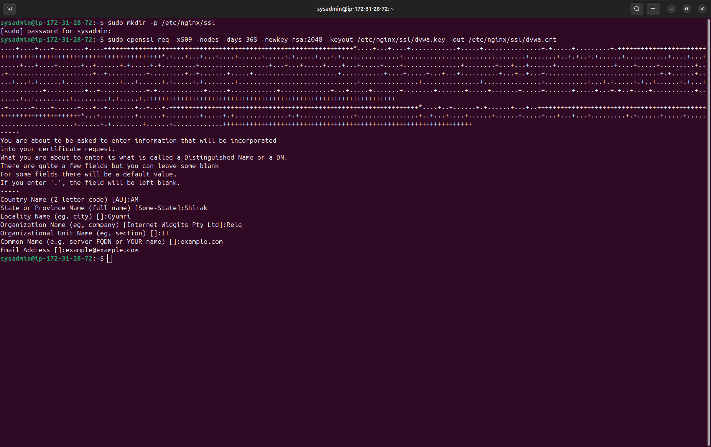

## 2. Configure Nginx as Reverse Proxy with HTTPS

***Create a server block:***
```bash
sudo nano /etc/nginx/sites-available/dvwa
```
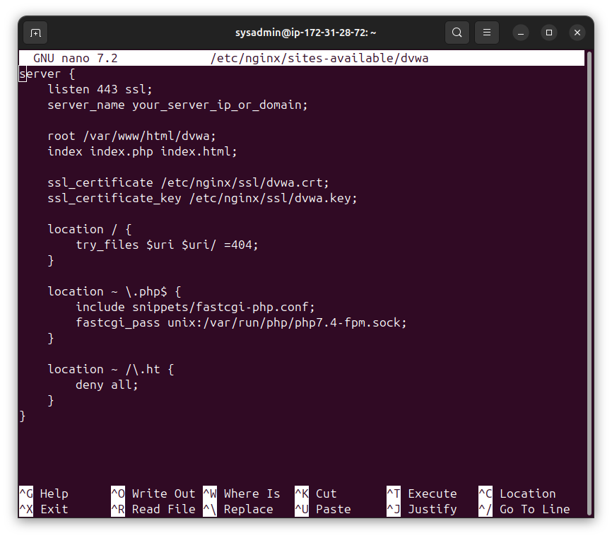

## 3. Enable Nginx Configuration
```bash
sudo ln -s /etc/nginx/sites-available/dvwa /etc/nginx/sites-enabled/
sudo nginx -t
sudo systemctl restart nginx
```

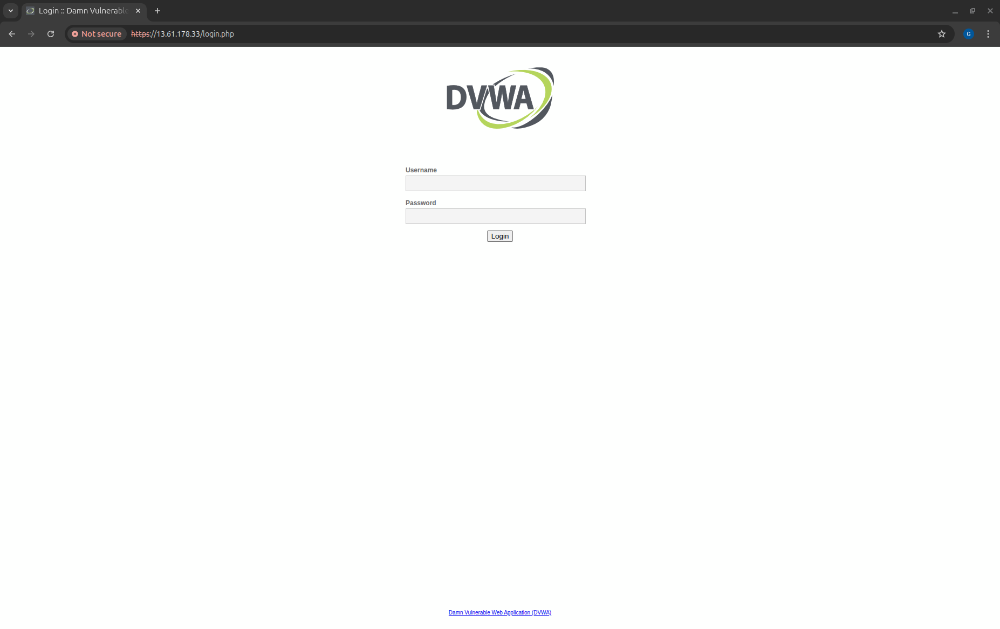

# Docker + OWASP Juice Shop

## Overview

OWASP Juice Shop was deployed in a Docker container on an Ubuntu Server to demonstrate container-based deployment of a vulnerable web application for security testing.

The application runs on port 3000 and is accessible from a local machine.

## 1. Verify Docker Installation
```bash
sudo apt install docker.io
docker --version
systemctl status docker
```
## 2. Pull OWASP Juice Shop Image
```bash
sudo docker pull bkimminich/juice-shop
```
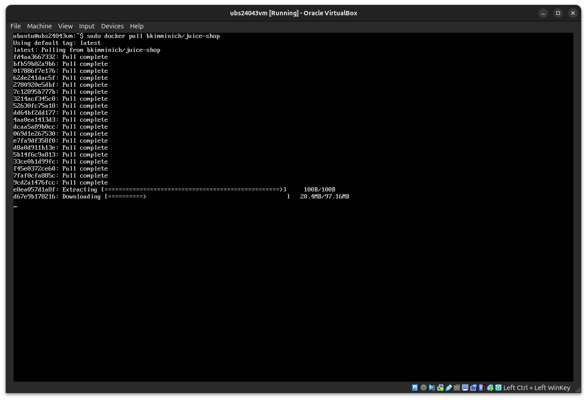

## 3. Run the Container
```bash
sudo docker run -d \
  --name juice-shop \
  -p 3000:3000 \
  --restart unless-stopped \
  bkimminich/juice-shop
```
## 4. Verify Container Status
```bash
docker ps
docker logs juice-shop
```
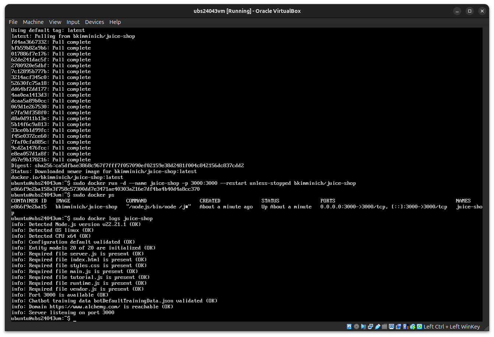

## 5. Firewall Configuration
```bash
sudo ufw allow 3000/tcp
sudo ufw reload
```

## 6. Access from Local PC

***Open in browser:***

>http://SERVER_PUBLIC_IP:3000

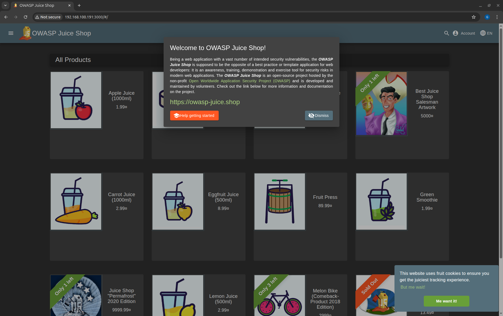
